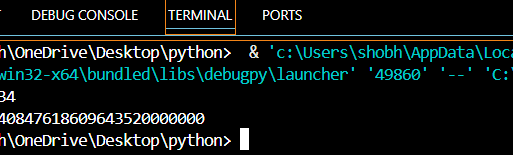

# fibanacci
logics

    def factorial(n):
    fact=1
    for i in range(n,0,-1):
        fact=fact*i
    return fact
    n=int(input("Enter a number: "))
    print(factorial(n))
'''
logics output

'''

'''